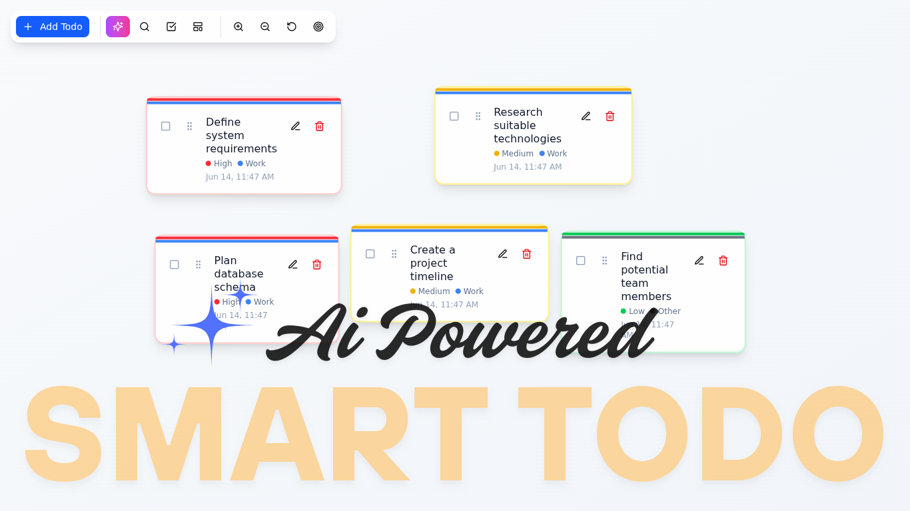

# Smart Todo Canvas



A modern, visual todo management application that transforms traditional task lists into an interactive canvas experience. Organize your tasks with drag-and-drop functionality, AI-powered suggestions, and advanced filtering capabilities.

## ✨ Features

### 🎨 Visual Canvas Interface
- **Interactive Canvas**: Pan, zoom, and navigate through your tasks on an infinite canvas
- **Drag & Drop**: Intuitively move tasks around the canvas with smooth animations
- **Smart Positioning**: Automatic positioning algorithm prevents overlapping cards
- **Grid Background**: Visual grid helps with organization and alignment

### 🤖 AI-Powered Assistant
- **Smart Suggestions**: Get AI-generated todo suggestions based on your context
- **Productivity Analysis**: Receive insights about your task patterns and productivity
- **Auto-Categorization**: Intelligent categorization of tasks
- **Title Improvement**: AI-enhanced task titles for better clarity

### 📋 Advanced Task Management
- **Priority Levels**: Low, medium, and high priority with visual indicators
- **Categories**: Work, personal, shopping, health, learning, and other
- **Templates**: Pre-defined task templates for common activities
- **Bulk Operations**: Select multiple tasks for batch operations

### 🔍 Search & Filter
- **Real-time Search**: Instantly find tasks by title
- **Category Filtering**: Filter tasks by specific categories
- **Priority Filtering**: Show only tasks with certain priority levels
- **Combined Filters**: Use multiple filters simultaneously

### 🎯 User Experience
- **Responsive Design**: Works seamlessly on desktop and mobile
- **Dark Mode Support**: Automatic theme switching
- **Persistent Storage**: Your tasks are saved locally
- **Smooth Animations**: Framer Motion powered interactions
- **Toast Notifications**: Instant feedback for actions

## 🚀 Getting Started

### Prerequisites
- Node.js 18+ or Bun
- Google Gemini API key (for AI features)

### Installation

1. **Clone the repository**
   ```bash
   git clone https://github.com/TajwarSaiyeed/smart-todo
   cd smart-todo
   ```

2. **Install dependencies**
   ```bash
   bun install
   # or
   npm install
   ```

3. **Set up environment variables**
   Create a `.env.local` file in the root directory:
   ```env
   GEMINI_API_KEY=your_google_gemini_api_key_here
   ```

4. **Run the development server**
   ```bash
   bun dev
   # or
   npm run dev
   ```

5. **Open your browser**  
   Navigate to [http://localhost:3000](http://localhost:3000)

## 🛠️ Tech Stack

- **Framework**: Next.js 15 with App Router
- **Frontend**: React 19, TypeScript
- **Styling**: Tailwind CSS 4, shadcn/ui components
- **State Management**: Zustand with persistence
- **Drag & Drop**: @dnd-kit/core
- **Canvas**: react-zoom-pan-pinch
- **Animations**: Framer Motion
- **AI Integration**: Google Generative AI (Gemini)
- **Build Tool**: Turbopack
- **Package Manager**: Bun

## 📁 Project Structure

```
smart-todo/
├── app/                    # Next.js app directory
│   ├── page.tsx           # Main page component
│   ├── layout.tsx         # Root layout with metadata
│   └── globals.css        # Global styles
├── components/            # React components
│   ├── ui/               # shadcn/ui components
│   ├── canvas.tsx        # Main canvas component
│   ├── todo-card.tsx     # Individual todo card
│   ├── ai-assistant.tsx  # AI features
│   └── ...               # Other components
├── lib/                  # Utilities and store
│   ├── store.ts          # Zustand state management
│   └── utils.ts          # Utility functions
├── actions/              # Server actions
│   └── ai.ts            # AI-related functions
└── public/              # Static assets
```

## 🎯 Usage Guide

### Creating Todos
1. Click the "Add Todo" button in the top-left control panel
2. Enter your task title, select priority and category
3. Click "Add Todo" to place it on the canvas
4. Use the AI Assistant for smart suggestions

### Managing Todos
- **Move**: Drag todos around the canvas
- **Edit**: Click the edit icon on any todo card
- **Delete**: Drag todos to the delete bucket or use the trash icon
- **Select**: Click the checkbox to select multiple todos

### Using AI Features
1. Click the AI Assistant button (✨ icon)
2. Enter context for suggestions or analyze your productivity
3. Get intelligent recommendations and insights
4. Apply suggestions directly to your canvas

### Navigation
- **Pan**: Click and drag on empty canvas space
- **Zoom**: Use mouse wheel or zoom controls
- **Center**: Click the target icon to center on your todos
- **Reset**: Use the reset button to return to default view

## 🔧 Configuration

### Environment Variables
- `GEMINI_API_KEY`: Required for AI features (get from Google AI Studio)

### Customization
- Modify `lib/store.ts` to adjust default categories, priorities, or templates
- Update `components/ui/` files to customize the design system
- Edit `app/globals.css` for global styling changes

## 🤝 Contributing

1. Fork the repository
2. Create a feature branch (`git checkout -b feature/amazing-feature`)
3. Commit your changes (`git commit -m 'Add amazing feature'`)
4. Push to the branch (`git push origin feature/amazing-feature`)
5. Open a Pull Request

## 📝 License

This project is open source and available under the [MIT License](LICENSE).

## 🙏 Acknowledgments

- [Next.js](https://nextjs.org/) for the incredible framework
- [Vercel](https://vercel.com/) for deployment platform
- [shadcn/ui](https://ui.shadcn.com/) for beautiful components
- [Google AI](https://ai.google.dev/) for Gemini API
- [Lucide React](https://lucide.dev/) for icons

---
